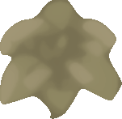

# Vector-Interpolator
### Introduction
The conversion from images to vector art is lossy, gaining edge detail but losing color detail. To compensate, this "vector interpolator" takes rasterized forms of vector art and attempts to reintroduce color detail between color boundaries, while still keeping the boundaries intact.

### Background
This was an old project from late 2020 to early 2021, with recent attempts to improve on old algorithms. Most of this was experimentations with color and understanding how colors actually mixed, based on basic pixel-principles and math.

### Algorithm
The current algorithm uses the inverse square law to determine colors, where "light sources" are determined to be at the center of color boundaries.

### Results
Base image:

Post-algorithm:

Gaussian Blur of Radius 3:

